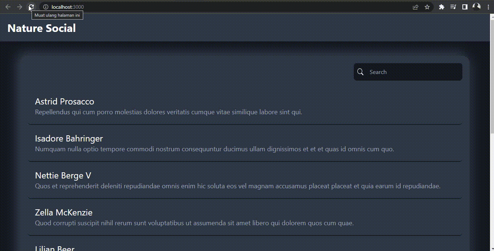
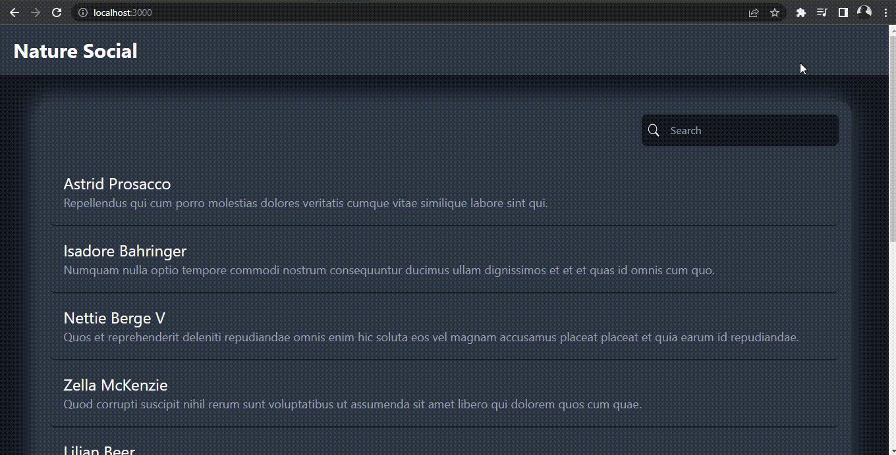

# Usage & Installation

1. Run `composer install`
2. Copy & Setup the .env file `cp .env.example .env`
3. Generate APP_KEY with `php artisan key:generate`
4. Create a database and config in `.env`
5. Run `php artisan migrate:fresh --seed`
6. Run `php artisan serve`
7. Backend is running!

### Result -- Demo Program

1. Load Data
   

2. Load More
   

3. Search Data
   

4. Responsive UI
   
